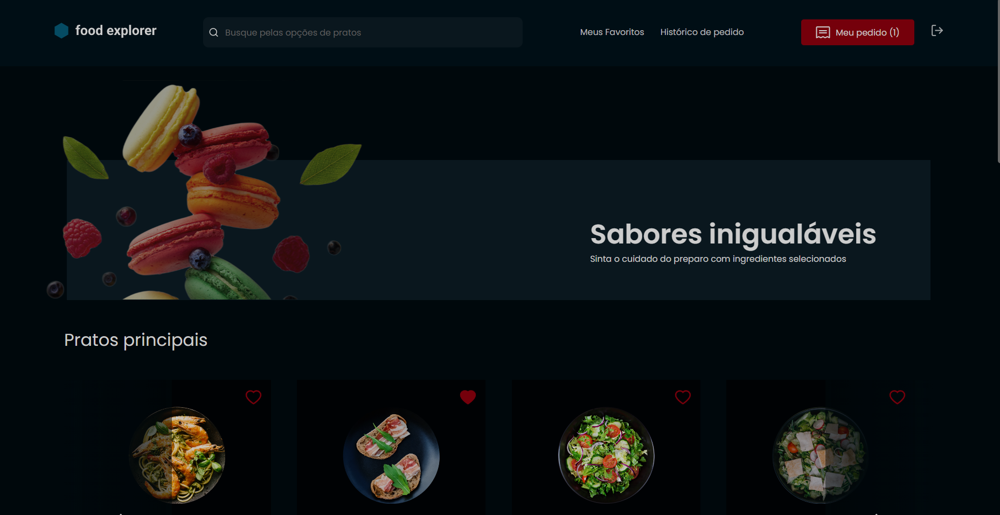
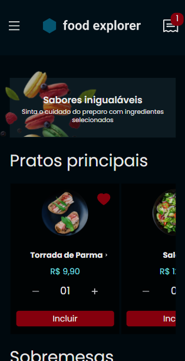

# Front-end-FoodExplorer

> Desktop version

> Mobile version

# Usuário comum
* Visualizar os pratos registrado
* Adicionar pratos para realizar um pedido
* Favoritar pratos
* Visualizar histórico dos seus pedidos

# Usuário administrador
* Visualizar pratos registrados
* Registrar pratos
* Editar pratos
* Deletar pratos
* Visualizar pratos que estão sendo favoritados pelos usuários
* Editar status dos pedidos

> Para ter acesso à conta de adm:
* Login: admin@email.com
* Senha: 123

# Techs
* React
* Axios
* Vite
* Styled-components

# Como rodar o projeto
npm run dev
